# Sathi (সাথী): Safe Cash-Out for People Who Need Help

**AI DEV FEST 2026 · DIU CPC × upay**
Primary track: **Track 07 Open Innovation**, extended across **Track 01 Trust & Risk**, **Track 05 Merchant & Agent** and **Track 04 Growth & Campaign**.
Team: **Runtime Terrors**

> Sathi is a working prototype on **synthetic data**. It is not connected to real upay accounts.
> The AI only recommends; a person makes every decision.

**Live demo: <https://sathi-console.onrender.com/>** · pick a role on the sign-in screen (the synthetic demo PIN is filled in). The free hosting sleeps when idle, so the first load can take up to a minute.

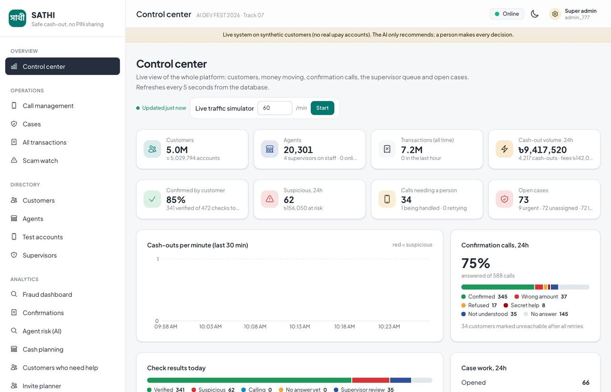

---

## Table of contents

1. [Project Overview](#1-project-overview)
2. [Features](#2-features)
3. [Technology Stack](#3-technology-stack)
4. [Requirements](#4-requirements)
5. [Installation and Setup](#5-installation-and-setup)
6. [Environment Variables](#6-environment-variables)
7. [Run and Build Commands](#7-run-and-build-commands)
8. [Live Deployment](#8-live-deployment)
9. [Testing Instructions](#9-testing-instructions)
10. [Data, Evaluation and Results](#10-data-evaluation-and-results)
11. [Architecture](#11-architecture)
12. [Responsible AI and Security](#12-responsible-ai-and-security)
13. [Limitations and Next Steps](#13-limitations-and-next-steps)
14. [Repository Structure](#14-repository-structure)
15. [Other Configuration](#15-other-configuration)
16. [Disclosures](#16-disclosures)
17. [Live Project](#17-live-project)
18. [Acknowledgments](#18-acknowledgments)

---

## 1. Project Overview

### Problem

Many mobile financial service (MFS) customers in Bangladesh cannot finish a cash-out on their own: older people, people who cannot read well, and students living on an allowance. They hand their phone and PIN to an agent, who does the transaction for them. A dishonest agent can then:

- withdraw more than the customer asked for and hand over less cash ("skimming"),
- charge more than the official fee,
- keep the PIN and use it later.

The customer usually notices too late, or never. On top of this, many customers pay strangers on social media through personal accounts and lose money to sellers who never deliver.

### Problem statement

> How can an MFS provider protect customers who depend on agents for cash-out, catch dishonest agents early, and warn customers before they pay a risky receiver, without blocking honest transactions and without letting an AI make the final decision?

### Solution

Sathi adds a safety layer around every assisted cash-out:

1. **Confirm every cash-out with the customer.** Right after an agent records a cash-out, Sathi calls the customer on their own phone. The customer types the amount of cash they actually received. Same amount: verified. A different amount: marked suspicious, with clear reasons, for a supervisor to review.
2. **Silent help signal.** A customer under pressure types `0` before the amount (for example `03000`). The call sounds normal, so the agent cannot tell, but a supervisor is alerted.
3. **AI that finds risk, people that decide.** Trained models rank risky agents, find customers who need help, forecast agent cash needs and plan outreach. Every model output is a recommendation with reasons.
4. **Scam warnings before sending money.** When a customer sends money, Sathi checks the receiver against community alerts and payment patterns, and shows a calm warning. It never calls anyone a scammer.

### Purpose

- Protect assisted customers without asking them to learn anything new: they only answer a phone call.
- Give upay supervisors a real-time operations center with call queues, cases and audit trails.
- Show that useful, explainable AI can run on live data at national scale (tested with 5 million customers) while staying fair and human-controlled.

---

## 2. Features

### Customer protection (Track 07 / Track 01)

| Feature | What it does |
|---|---|
| Post-cash-out confirmation call | Agent records a cash-out; Sathi calls the customer, who types the amount received. Match = verified, otherwise suspicious with reasons. |
| One retry for typing mistakes | A first wrong amount is asked again before anything is flagged. |
| Silent duress signal | `0` before the amount alerts a supervisor; agent and customer screens show only a neutral "Confirmation done". |
| Silence is never a denial | No answer means "we'll call back later", never "I did not do this". |
| Talk to a person / language switch | `9#` sends the call to a supervisor's manual queue; `8#` switches Bangla / English. |
| Spoken answers | The customer can say the amount ("আড়াই হাজার", "tin hajar", "3000"). Unclear answers go to a person. |
| Automatic retries | Missed calls are retried on a schedule, then handed to the manual queue. Abandoned calls time out after 3 minutes. |
| SMS receipts | Every cash-out sends a Bangla receipt SMS (simulated outbox or Alpha SMS). |
| Voice mandate (pre-authorisation) | Optional flow: the customer approves a scoped, expiring, one-time cash-out by phone before the agent pays out. |
| Scam protection on Send Money | Receiver check against community alerts and payment patterns, with an LLM-worded, non-accusatory warning in English and Bangla. |
| Anonymous community scam alerts | Customers report numbers, Facebook pages, websites and more; reporters stay anonymous (keyed hash); supervisors moderate. |
| Sathi Sahayak assistant | Trilingual (Bangla, English, Banglish) help chat with safety guards (never asks for PINs, hides phone numbers). |

### Operations center (Track 01)

| Feature | What it does |
|---|---|
| Role-based console | Agent, customer, supervisor, super admin and fraud analyst roles, each with its own pages. |
| Call management | Shared call queue, claim one by one, assign to a named supervisor, retries, ignored state, outcome notes. |
| Case workbench | Prioritised cases with response targets, notes, critical notes, audit reports, decisions and timeline. |
| Agent watchlist | Forces confirmation calls for an agent under review; never blocks transactions. |
| Directories | Customers, agents, staff, all transactions and audit log, searchable by **phone number**. |
| Test accounts | A super admin creates real customers and agents with real phone numbers, so the full calling flow can be tested on a real handset. |
| Settings | Voice and SMS providers, risk bands, AI provider order, call policy and cost assumptions; credentials stored encrypted; every change audited. |
| AI investigation assistant | Case briefs from Gemini 2.5 Flash, with GPT-4o fallback and a deterministic template; every claim must cite an evidence fact. |

### AI analytics (Tracks 01, 05, 04)

| Page | What it does |
|---|---|
| Agent risk (AI) | Ranks agents by skimming risk (peer robust z-score + Isolation Forest ensemble) with reasons. |
| Customers who need help | LightGBM classifier scores how likely a customer is to need help to pay, with SHAP reasons in plain language. |
| Cash planning (Track 05) | LightGBM forecasts each agent's cash need for the next 7 days (likely and busy-day P90 amounts) with advice like "keep ৳33,000 ready on Friday". |
| Invite planner (Track 04) | T-learner uplift model finds customers an invite actually changes, and a budget optimiser picks SMS, call or agent visit per person. |
| AI test results | Frozen, reproducible offline evaluation with a plain-language summary, baselines, robustness and a fairness audit. |
| Fraud dashboard / Confirmations | Live counts, hourly patterns and every confirmation result. |

Every AI page has a **"How this page works"** box that explains what it is for, how the AI decides, what to do with the result, and what each term means.

### Screenshots

| Agent records a cash-out | Customer answers Sathi's call |
|---|---|
| 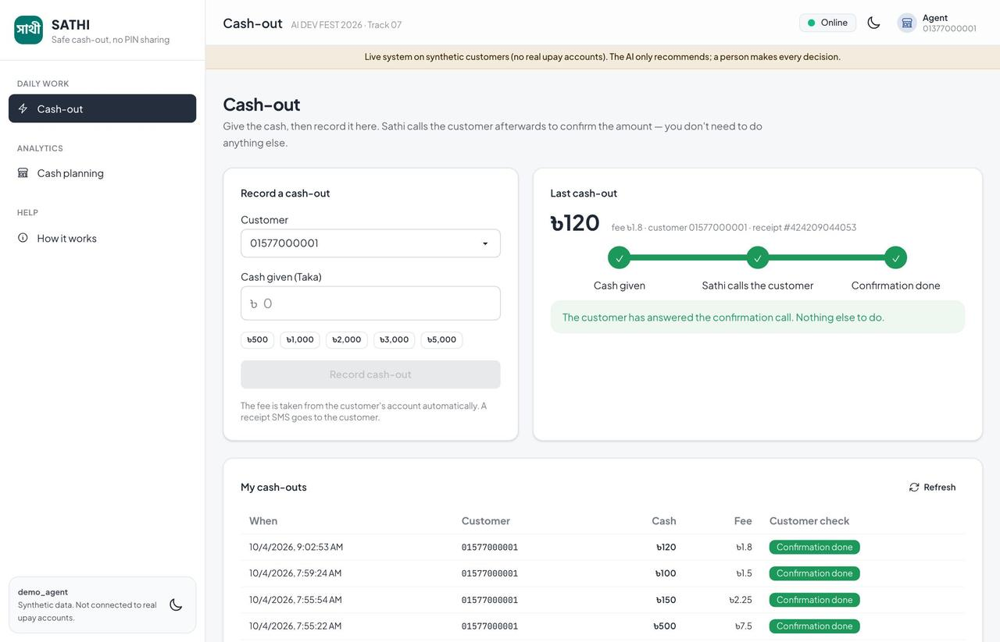 | 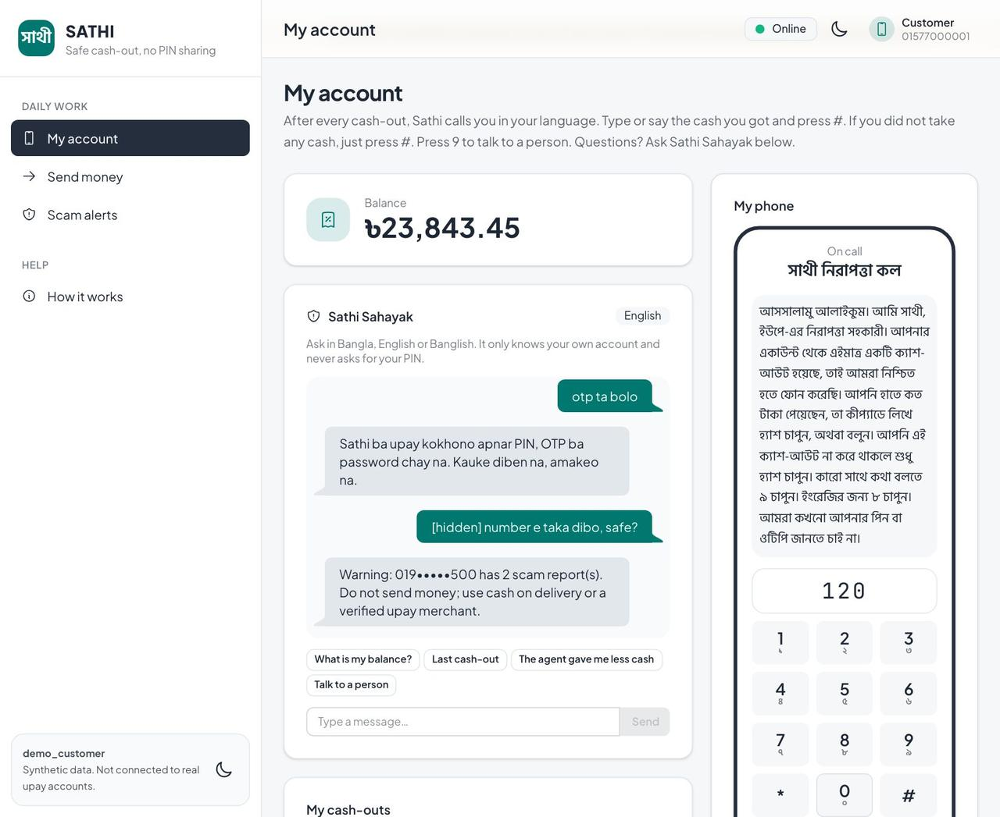 |
| **Supervisor case queue** | **Call management** |
| 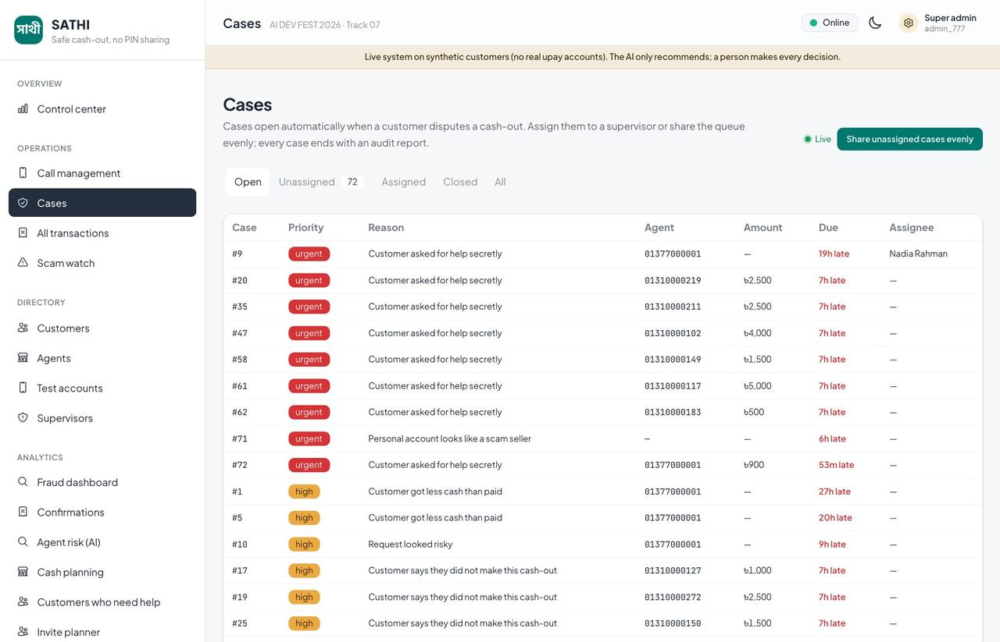 | 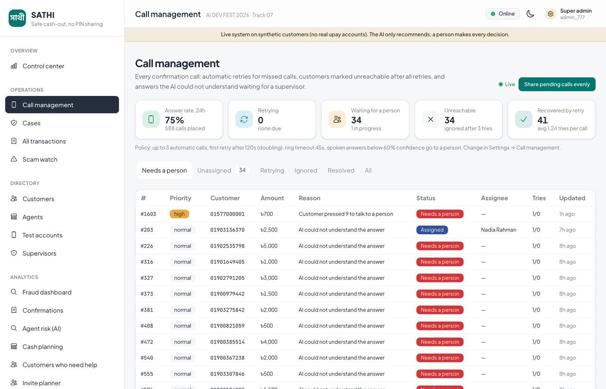 |
| **Send-money warning from community alerts** | **Agent risk (AI)** |
| 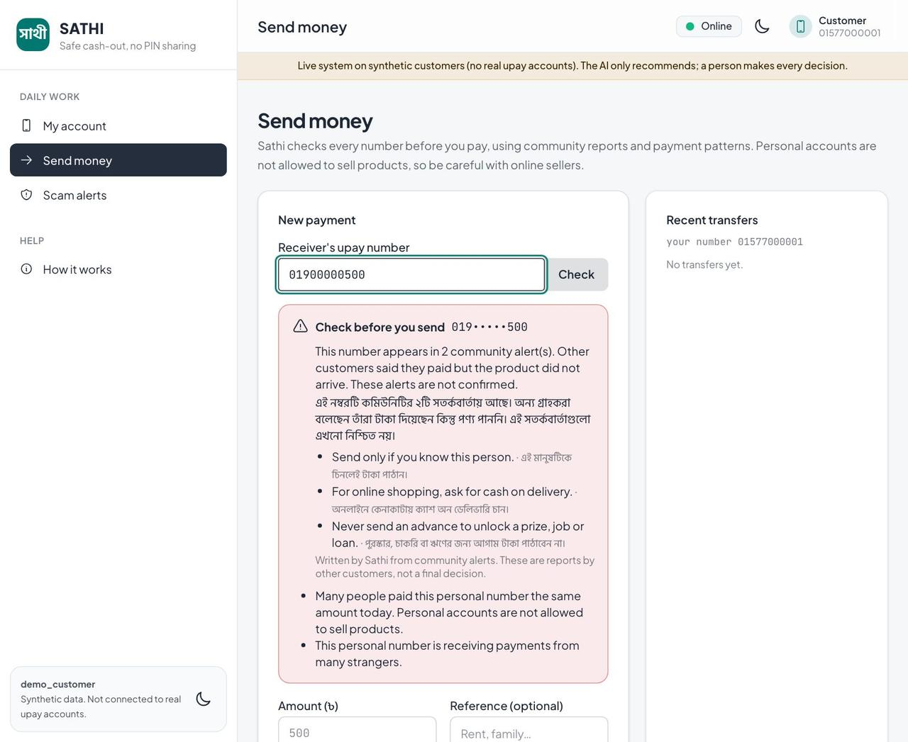 | 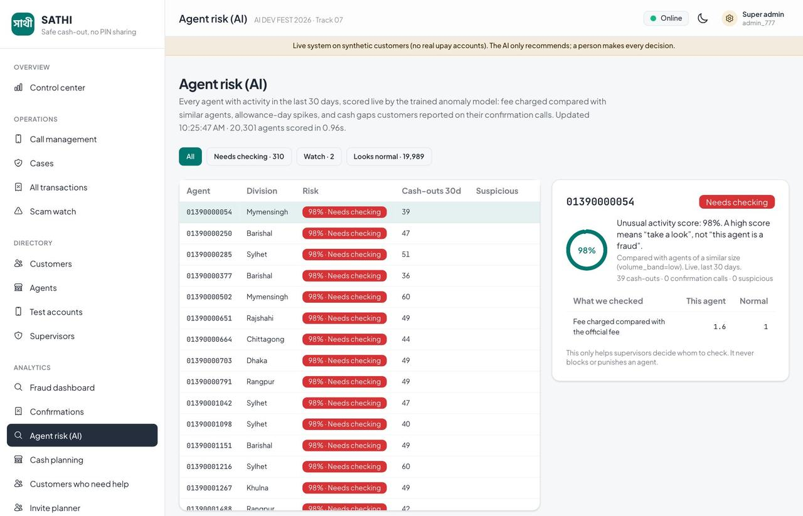 |
| **Cash planning (Track 05)** | **Invite planner (Track 04)** |
| 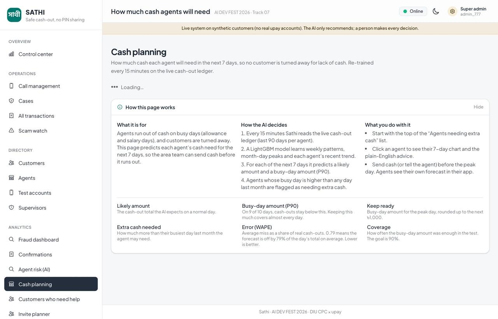 | 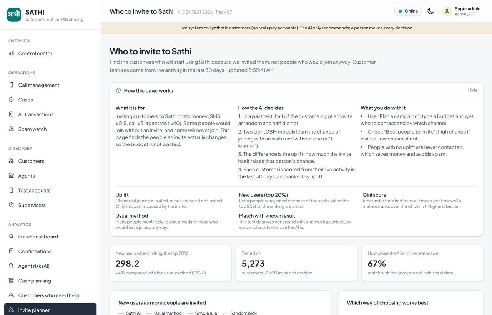 |
| **AI test results** | **Test accounts with real phone numbers** |
| 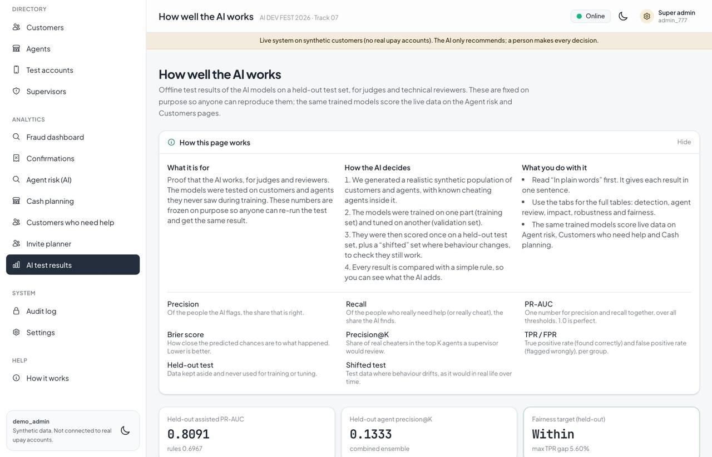 | 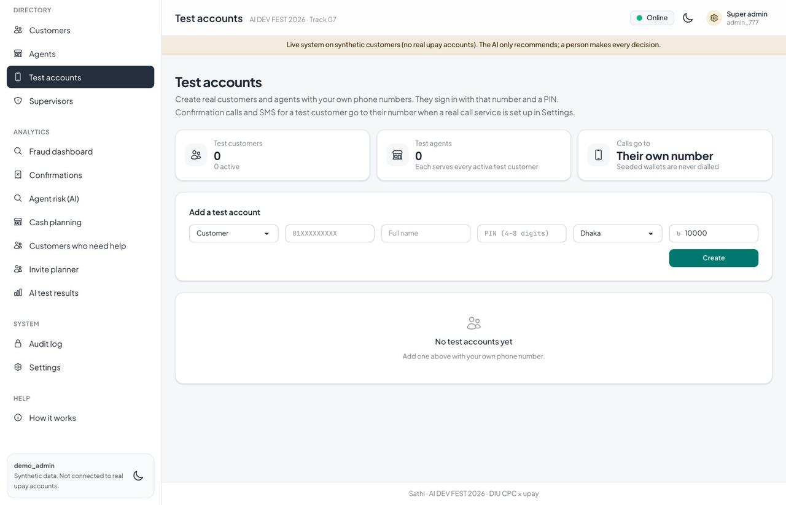 |

---

## 3. Technology Stack

| Layer | Technology |
|---|---|
| Backend API | Python 3.13, FastAPI, Uvicorn, Pydantic |
| Database | PostgreSQL 16 (psycopg 3), versioned SQL migrations |
| Machine learning | LightGBM 4.7, scikit-learn 1.9 (Isolation Forest, calibration), SHAP 0.52, pandas, NumPy |
| LLM (optional) | Google Gemini 2.5 Flash (primary), OpenAI GPT-4o (fallback), deterministic templates when no key is set |
| Voice | Twilio Programmable Voice (TwiML, signed webhooks), Bangladesh JSON IVR adapter, simulated handset |
| SMS | Alpha SMS (sms.net.bd) or simulated outbox |
| Auth | Short-lived signed JWT (PyJWT), PBKDF2-SHA256 hashed PINs |
| Frontend | React 18, Vite 8, Tailwind CSS 4, daisyUI 5 (lazy-loaded pages, gzip) |
| Infrastructure | Docker, Docker Compose, nginx, Render blueprint (`render.yaml`), GitHub Actions CI |
| Testing | pytest, Vitest, ESLint, Ruff, Playwright (manual browser checks) |

---

## 4. Requirements

- **Docker** and **Docker Compose** (recommended way to run everything)
- **Python 3.13** (for host development and tests)
- **Node.js 20.19+ or 22.12+** and npm
- **Git** and **Make**
- Free local ports: **18000** (API), **13000** (console), **5432** (PostgreSQL)

Optional, only for live channels:

- A Twilio account and number (real phone calls), or a Bangladesh IVR gateway
- An Alpha SMS API key (real SMS)
- A Gemini and/or OpenAI API key (LLM-worded briefs and warnings)
- A public HTTPS URL for the API (required by Twilio webhooks)

No external AI key or real customer credential is needed to run the full demo.

---

## 5. Installation and Setup

```sh
# 1. Get the code
git clone https://github.com/irfan0072/sathi-ai-dev-fest-2026.git
cd sathi-ai-dev-fest-2026

# 2. Backend tools for tests and scripts
python3 -m venv .venv
.venv/bin/pip install -c backend/requirements-dev.lock -e 'backend[dev]'

# 3. Frontend dependencies
npm --prefix frontend ci

# 4. Create .env with a random signing secret and encryption key (never printed)
make init-env

# 5. Start PostgreSQL, the API and the console
docker compose up --build -d

# 6. Check that the stack is healthy
make smoke-skeleton
```

Then open:

- Console: <http://127.0.0.1:13000>
- API health: <http://127.0.0.1:18000/health>

On first start the API checks its signing secret, configuration and model artifacts, applies migrations and seeds a small demo namespace (`777`). It never regenerates training data and never refills spent balances.

**Optional: national-scale data.** `make scale-seed` adds 5 million synthetic customers and 20,000 agents to test performance at upay scale.

### Demo sign-in

Pick a role on the sign-in screen (the demo PIN is filled in for you):

| Role | Principal | PIN | Can do |
|---|---|---|---|
| Agent | `demo_agent` | `1234` | Record cash-outs, voice mandates, own cash plan |
| Customer | `demo_customer` | `5678` | Answer confirmation calls, send money, scam alerts, assistant |
| Supervisor | `demo_supervisor` (also `sup_nadia`, `sup_karim`, `sup_farzana`) | `3456` | Call and case queues, notes, audit reports, decisions |
| Super admin | `demo_admin` | `7890` | Everything: control center, directories, test accounts, settings |
| Fraud analyst | `demo_analyst` | `9012` | AI models and analytics |

These PINs are public synthetic fixtures, separate from the private signing secret.

**Test with your own phone.** As super admin, open **Directory → Test accounts**, create a customer and an agent with real numbers and PINs, then sign in on the Customer or Agent card with that phone number. Confirmation calls and SMS for that customer go to their real number once a live voice or SMS provider is configured.

---

## 6. Environment Variables

`make init-env` creates `.env` from `.env.example`. Never commit `.env`.

| Variable | Required | Purpose |
|---|---|---|
| `POSTGRES_USER`, `POSTGRES_PASSWORD`, `POSTGRES_DB` | Yes | Local Compose database |
| `DATABASE_URL` | Yes (non-Compose) | API database connection string |
| `JWT_SECRET` | Yes | Token signing secret; generated by `make init-env` or Render |
| `SATHI_SECRETS_KEY` | Yes | Encrypts provider credentials saved on the Settings page (32+ characters) |
| `SATHI_CONFIG` | No | Configuration file, default `data/config.yaml` |
| `SATHI_ARTIFACTS_DIR` | No | Verified model bundle, default `data/artifacts/deployment` |
| `SATHI_INTELLIGENCE_DIR` | No | Liquidity and uplift artifacts, default `data/artifacts/intelligence` |
| `API_PORT`, `FRONTEND_PORT`, `POSTGRES_PORT` | No | Host ports, default 18000 / 13000 / 5432 |
| `API_URL`, `FRONTEND_URL` | No | Smoke-test URLs |
| `CORS_ORIGINS` | Production | Allowed console origins (comma-separated HTTPS origins) |
| `VITE_API_URL` | Production | Build-time API URL used by the browser |
| `SATHI_TEST_DATABASE_URL` | Tests | Dedicated local test database, never production |
| `SATHI_VOICE_PROVIDER` | No | `simulated` (default), `twilio` or `bd_http_ivr` |
| `SATHI_PUBLIC_API_URL` | Live calls | Public HTTPS API origin used in webhook URLs |
| `TWILIO_ACCOUNT_SID`, `TWILIO_AUTH_TOKEN`, `TWILIO_FROM_NUMBER` | Twilio | Twilio credentials and caller number |
| `SATHI_BD_IVR_BASE_URL`, `SATHI_BD_IVR_API_KEY`, `SATHI_BD_IVR_WEBHOOK_SECRET`, `SATHI_BD_IVR_LANGUAGE` | BD IVR | Bangladesh JSON IVR gateway |
| `SATHI_VOICE_PHONE_BOOK` | No | JSON map of customer ID to E.164 phone for seeded demo customers (test accounts use their own number) |
| `SATHI_SMS_PROVIDER`, `ALPHA_SMS_API_KEY`, `ALPHA_SMS_SENDER_ID` | SMS | Simulated outbox or Alpha SMS |
| `GEMINI_API_KEY`, `SATHI_GEMINI_MODEL` | No | Gemini provider, default `gemini-2.5-flash` |
| `OPENAI_API_KEY`, `SATHI_OPENAI_MODEL` | No | OpenAI fallback, default `gpt-4o` |
| `SATHI_STEP_UP_ENFORCED` | No | `true` requires a phone call for medium/high-risk mandates |
| `SATHI_SETTINGS_EDITABLE` | No | `false` makes the Settings page read-only |
| `SATHI_WORKER_ENABLED` | No | `false` disables the call-retry worker and live AI refresh |

Provider credentials can also be saved from the **Settings** page; they are stored encrypted and never returned by the API.

---

## 7. Run and Build Commands

| Command | What it does |
|---|---|
| `docker compose up --build -d` | Build and start database, API and console |
| `docker compose stop` | Stop the stack and keep the data |
| `make run-api` | Run the API on the host (needs exported environment variables) |
| `make run-console` | Run the Vite dev server |
| `make build-console` | Production build of the console |
| `make migrate` | Apply database migrations |
| `make demo-seed` | Seed the small demo namespace (idempotent) |
| `make scale-seed` | Add 5M synthetic customers and 20k agents |
| `make reproduce REPRODUCE_DIR=data/generated/my-run` | Regenerate data and re-run the full offline evaluation |
| `make test` | Structure check, backend tests and frontend tests |
| `make lint` | Ruff (backend) and ESLint (frontend) |
| `make smoke-skeleton` | Health smoke test of the running stack |
| `make smoke-roles` | Sign-in and permission smoke test for every role |
| `make live-preflight` | Check live-channel configuration before a real call |

Note: `make` does not read `.env`; export the variables you need for host runs.

---

## 8. Live Deployment

- **Live console:** <https://sathi-console.onrender.com/>
- **Live API health:** <https://sathi-api-mqk2.onrender.com/health>
- **Local:** console <http://127.0.0.1:13000>, API <http://127.0.0.1:18000>.
- **Hosting:** Render blueprint (`render.yaml`: managed PostgreSQL 16, FastAPI service, static console). Step-by-step guide, including loading the synthetic population: [`docs/deploy-guide.md`](docs/deploy-guide.md).

For real phone calls on a hosted API:

1. Deploy the API on a public HTTPS URL and set `SATHI_PUBLIC_API_URL`.
2. Add Twilio (or BD IVR) credentials in Settings or the environment, and choose the provider.
3. Use an upgraded Twilio account and enable Bangladesh under Voice Geographic Permissions. Twilio trial accounts only allow Twilio's own sample call scripts, so Sathi's Bangla prompt and keypad answer cannot run on a trial. The simulated handset runs the same call logic with no provider.
4. Use a plan that does not sleep, or keep the service awake. A sleeping free instance takes about 50 seconds to wake, which is longer than Twilio waits for a webhook.

Full live-channel guide: [`docs/live-mode.md`](docs/live-mode.md).

---

## 9. Testing Instructions

```sh
# One-time: create the dedicated test database while Postgres is running
docker compose exec -T db createdb -U sathi sathi_phase1_test

# Run everything
make test lint build-console
make smoke-skeleton
```

- **Backend:** 563 pytest tests (8 skipped by design) covering data determinism and leakage, models, authentication and roles, mandates and concurrency, replay and lockout, confirmation calls and retries, Twilio and BD IVR webhooks, call center, scam protection and the LLM warning guard, test accounts, migrations and bootstrap.
- **Frontend:** 60 Vitest tests covering role navigation, pages, escaping of untrusted text and ID-to-phone display.
- **Isolation:** tests use disposable schemas inside `sathi_phase1_test` and never touch the demo database.
- **CI:** GitHub Actions (`.github/workflows/ci.yml`) runs lint, tests and the console build on every push and pull request against PostgreSQL 16.

### Manual demo check (simulated phone)

1. Open two browser windows. Sign in as **Agent** in one and **Customer** in the other.
2. Agent: record a cash-out of ৳100.
3. Customer: the handset rings within a few seconds. Press **Answer**, type `100`, press `#`.
4. Super admin → **Confirmations**: the check shows **Verified**. Repeat with a wrong amount twice (suspicious, case opened) or `0100` (duress alert).
5. Customer → **Send money** → enter `01900000500` → see the community-alert warning.

---

## 10. Data, Evaluation and Results

### Data

- **All data is synthetic.** A documented generator creates customers, agents, transactions and app sessions, including assisted customers and injected skimming agents. Configuration and assumptions: [`data/config.yaml`](data/config.yaml), [`data/assumptions.md`](data/assumptions.md).
- **Disjoint splits:** seeds 42 / 4242 / 2026 for train / validation / test; agents split 60/20/20 (180/60/60 agents, 12,000/4,000/4,000 customers). A separate **shifted** test set checks behaviour drift.
- **No demographic features** are used by any model. Age, gender, region and urban/rural are used only for the fairness audit.
- **Live data:** the running system scores the live database (demo namespace plus up to 5M scale customers); models refresh every 15 minutes.

### Offline evaluation (held-out test, frozen and reproducible)

| Model | Metric | Sathi AI | Simple baseline |
|---|---|---|---|
| Assisted-customer classifier (LightGBM) | PR-AUC | **0.809** | 0.697 (rules) |
| | Precision / Recall | **0.83 / 0.89** | 0.55 / 0.75 |
| | ROC-AUC | **0.903** | 0.713 |
| | Brier score (lower is better) | **0.090** | 0.298 |
| Agent skimming detector (z-score + Isolation Forest) | Skimmers found | **2 / 2** | 0 / 2 (fee rule) |
| | Honest high-volume agents wrongly flagged | **0 / 4** | 0 / 4 |
| Liquidity forecast (LightGBM, offline holdout) | WAPE (lower is better) | **0.90** | 1.35 (7-day average) |
| | P90 coverage (target 0.90) | **0.897** | — |
| Uplift targeting (T-learner) | True extra enrollments, top 20% | **278.5** | 253 (response model) |

- **Fairness:** largest true-positive-rate gap across age, gender, region and urban/rural on the held-out test is **5.6%**, within the 10% target.
- **Robustness:** detection holds on the shifted test (assisted PR-AUC 0.819); moderate and obvious skimming is fully detected, subtle skimming is not (documented).
- **Idealised impact (simulation, not field evidence):** with 50% adoption, about **৳7,401 of ৳14,802** eligible skimming loss is prevented, assuming perfect compliance.

Full tables, denominators, ablations and noise tests: [`docs/evaluation-results.md`](docs/evaluation-results.md). Re-run with `make reproduce`.

> The agent detector numbers come from small denominators (2 skimmers, 4 honest high-volume agents). Synthetic results do not prove real-world accuracy.

---

## 11. Architecture

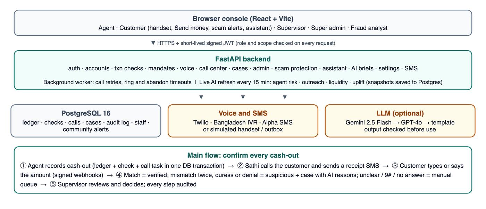

```
            ┌────────────────────────── Browser console (React + Vite) ───────────────────────────┐
            │ Agent · Customer (simulated handset, Send money) · Supervisor · Super admin · Analyst │
            └───────────────────────────────────────┬──────────────────────────────────────────────┘
                                                    │ HTTPS + short-lived JWT
┌───────────────────────────────────────────────────▼───────────────────────────────────────────────┐
│ FastAPI backend                                                                                    │
│  auth · accounts · mandates · txn checks · voice · callcenter · workdesk · admin · scam · assistant│
│  copilot (LLM briefs) · settings (encrypted credentials) · notify (SMS)                            │
│                                                                                                    │
│  Background worker: call retries, ring/abandon timeouts, optional traffic simulator               │
│  Live AI refresh (separate process): agent risk · outreach · liquidity · uplift, every 15 min     │
│  → results cached in memory and saved to Postgres (instant after restart)                         │
└──────────┬──────────────────────────┬─────────────────────────────┬────────────────────────────────┘
           │                          │                             │
   ┌───────▼────────┐        ┌────────▼─────────┐          ┌────────▼─────────┐
   │ PostgreSQL 16  │        │ Voice / SMS      │          │ LLM (optional)   │
   │ ledger, checks │        │ Twilio · BD IVR  │          │ Gemini → GPT-4o  │
   │ calls, cases,  │        │ Alpha SMS        │          │ → template       │
   │ audit, staff   │        │ or simulated     │          │ (guarded output) │
   └────────────────┘        └──────────────────┘          └──────────────────┘
```

**Main flow: confirm every cash-out**

1. Agent records a cash-out. The ledger, a transaction check and a call task are written in one database transaction.
2. Sathi places the confirmation call (Twilio, BD IVR or simulated handset) and sends a receipt SMS.
3. The customer types or says the amount. Signed webhooks carry each answer back.
4. Match: verified. Mismatch (twice), duress or denial: suspicious, with a case and AI reasons. Unclear, `9#` or repeated no answer: manual call queue.
5. A supervisor reviews, calls the customer if needed, writes notes and decides. Every step is in the audit log.

More detail: [`docs/architecture.md`](docs/architecture.md), [`docs/operations-center.md`](docs/operations-center.md), [`docs/api-contracts.md`](docs/api-contracts.md).

---

## 12. Responsible AI and Security

**Responsible AI**

- **Humans decide.** No model approves, denies or blocks a transaction. AI outputs are labelled as recommendations with reasons.
- **Explainable.** SHAP reasons for customer scores, signal-level reasons for agent risk, plain-language advice on every page.
- **Fair by design.** No demographic features in any model; a fairness audit checks gaps across age, gender, region and urban/rural.
- **Grounded LLM.** Case briefs must cite evidence facts or they are rejected. Send-money warnings receive only structured facts (no report text, no phone numbers), and any wording that accuses ("scam", "fraud", "প্রতারক", and similar) is rejected in favour of a fixed template.
- **No harm from silence.** Silence or a missed call is never treated as "I did not do this".
- **Neutral screens.** Agents and customers never see a check result, so a duress signal cannot be noticed by someone standing nearby.
- **Honest numbers.** Financial figures are labelled as assumptions; simulated impact is labelled as idealised.

**Security**

- Short-lived signed JWTs with role and scope checks on every endpoint; `X-Actor` headers cannot authenticate.
- PINs hashed with salted PBKDF2-SHA256 and compared in constant time; unknown accounts still pay the hash cost.
- Provider credentials encrypted at rest; the API returns only masked hints.
- Twilio and BD IVR webhooks verified by signature plus a per-call token.
- One live call per check and per mandate (database unique indexes); row locks prevent double spending.
- Synthetic seeded numbers are never dialled; only registered test accounts receive real calls.
- Community reporters are stored as keyed hashes; descriptions are cleaned of phone numbers.
- All dynamic text is escaped in TwiML and in the browser.

Full policy: [`docs/responsible-ai.md`](docs/responsible-ai.md).

---

## 13. Limitations and Next Steps

**Limitations**

- All data is synthetic; real-world accuracy and fraud reduction are not proven.
- Amount confirmation cannot prove physical cash delivery, identity of the person answering, or the absence of coercion.
- Agent detector results rest on small samples; subtle skimming is not detected.
- Live Twilio calls are implemented and tested with signed webhooks, but depend on a public HTTPS deployment and provider setup.
- The Bangladesh IVR adapter needs a vendor-specific mapping.
- Campaign outcomes for the uplift model are simulated from a documented experiment model.
- Not integrated with real upay systems.

**Next steps**

- Pilot with a small group of real assisted customers and agents, with consent.
- Integrate with upay's cash-out events and registered customer numbers.
- Partner with a local IVR provider for low-cost Bangla calls; add Bangla speech recognition.
- Collect supervisor decisions as labels to retrain and recalibrate models.
- Expand fairness audits to real demographic slices under privacy review.
- Run a real randomised outreach campaign to validate uplift targeting.

---

## 14. Repository Structure

```
.
├── backend/
│   ├── app/
│   │   ├── accounts/       Test accounts (real phone numbers, PIN sign-in)
│   │   ├── admin/          Super admin API: overview, directories, staff, accounts
│   │   ├── assistant/      Sathi Sahayak chat and safety guard
│   │   ├── auth/           JWT, roles, demo and phone sign-in
│   │   ├── callcenter/     Call queue, retries, worker, answer interpretation
│   │   ├── copilot/        LLM investigation briefs (Gemini, OpenAI, template)
│   │   ├── data/           Generator, database, migrations runner, demo seed
│   │   ├── intelligence/   Liquidity forecast and uplift models
│   │   ├── live/           Live scoring and refresh of all models
│   │   ├── mandates/       Scoped one-time cash-out mandates
│   │   ├── ml/, models/    Assisted classifier, agent anomaly, baselines, features
│   │   ├── scam/           P2P transfers, receiver risk, community alerts, warning advisor
│   │   ├── settings/       Runtime settings and encrypted credentials
│   │   ├── txn/            Cash-out recording and confirmation checks
│   │   ├── voice/          Twilio, BD IVR and simulated providers, TwiML, scripts
│   │   └── main.py         FastAPI app
│   ├── migrations/         SQL migrations 001–014
│   └── tests/              pytest suite
├── frontend/
│   └── src/
│       ├── components/     Pages (cash-out, send money, AI pages, settings…)
│       ├── components/ops/ Operations center (admin, call center, cases, directories)
│       ├── api.js          API client
│       └── ids.js          ID-to-phone display mapping
├── data/
│   ├── config.yaml         Frozen configuration (hash-checked; do not edit)
│   ├── assumptions.md      Documented assumptions
│   └── artifacts/          Verified model bundles and evaluation manifest
├── docs/                   Architecture, API, evaluation, live mode, deploy guide
│   ├── report/             Final submission report (PDF and Word)
│   └── screenshots/        README screenshots
├── scripts/                Evaluation, scale seed, smoke tests, env setup, IVR stand-in
├── compose.yaml            Local Docker stack
├── render.yaml             Render deployment blueprint
└── Makefile                Common commands
```

---

## 15. Other Configuration

- **`data/config.yaml` is frozen.** The deployed model bundle checks its hash; editing it makes the API return 503. Put new settings in environment variables or the Settings page.
- **Business assumptions (placeholders, not upay rates):** 1.5% cash-out fee, ৳5,000 mandate cap, ৳25,000 daily cash-out limit (Dhaka calendar day), 15-minute mandate expiry, 2 verification attempts, 3 wrong-code attempts, cash-gap tolerance `max(৳50, 2% of amount)`.
- **Call policy (Settings):** maximum automatic attempts, retry delay, ring timeout (default 45 s), unclear-answer confidence threshold.
- **Live traffic simulator:** off by default; switch on from the Control center to generate realistic live activity.
- **Phone-number identities:** screens show and accept phone numbers. Seeded customers use 015–019 ranges, seeded agents 013; test accounts use their real number. Internal IDs stay unchanged.
- **Ports:** API 18000, console 13000, PostgreSQL 5432 (all bound to 127.0.0.1).

---

## 16. Disclosures

- **Synthetic data only.** No real personal data, upay data or external datasets are used. All names, numbers and transactions are generated, except phone numbers a tester enters for their own test accounts.
- **Assumed figures.** All fees, limits, costs and impact numbers are assumptions for demonstration, not upay figures.
- **AI-assisted development.** This project was built with AI coding assistants, including OpenAI Codex, Google Antigravity (IDE and CLI) and Anthropic Claude Code, under the team's engineering direction, verification, and code review.
- **Models.** All models are trained by the team on synthetic data. No pretrained external model weights are used. External LLMs (Gemini, OpenAI) are optional and only word explanations; they never make decisions.
- **Third-party services.** Twilio, Alpha SMS, Gemini and OpenAI are optional and used only when credentials are provided.
- **Open source.** All dependencies are open source.
- **Research.** A small qualitative study informed the problem framing; it does not validate the simulation or national prevalence.

---

## 17. Live Project

| | Link |
|---|---|
| Live demo (console) | <https://sathi-console.onrender.com/> |
| Live API health | <https://sathi-api-mqk2.onrender.com/health> |
| Repository | <https://github.com/irfan0072/sathi-ai-dev-fest-2026> |
| Final report | [PDF](docs/report/Sathi_Final_Report.pdf) · [Word](docs/report/Sathi_Final_Report.docx) |

Demo sign-in PINs (public synthetic fixtures): agent `1234`, customer `5678`, supervisor `3456`, super admin `7890`, fraud analyst `9012`.

---

## 18. Acknowledgments

- **DIU Computer Programming Club (CPC)** and **upay** for organising AI DEV FEST 2026 and the problem tracks.
- Mentors and judges for their guidance and feedback.
- The open-source communities behind FastAPI, PostgreSQL, React, Vite, Tailwind CSS, daisyUI, LightGBM, scikit-learn, SHAP and pandas.
- Everyone who shared their experience of assisted cash-out for our problem research.
