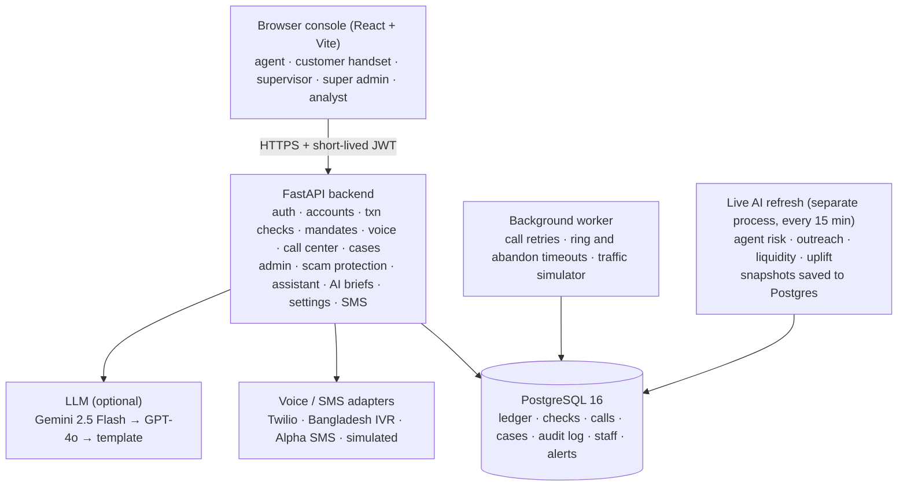

# Architecture

Sathi is a FastAPI service on PostgreSQL 16 with a React console. Voice and SMS providers
and the optional LLM sit behind adapters, so each can be swapped or simulated.

## Main flow: confirm every cash-out

1. The agent records a cash-out. The ledger row, a transaction check and a call task are
   written in one database transaction.
2. Sathi places the confirmation call through the active voice provider and sends a
   receipt SMS. The prompt never states the amount.
3. The customer types or says the amount. Provider webhooks are verified by signature plus
   a per-call token.
4. Match: verified. A first mismatch is asked again; a second mismatch, a duress answer
   (`0` before the amount) or a denial marks the check suspicious and opens a case with
   AI-ranked reasons. Unclear answers, `9#` and repeated missed calls go to the manual
   call queue. Silence is never a denial.
5. A supervisor reviews, calls the customer if needed and decides. Every step is written to
   the audit log. Agents and customers only ever see a neutral "Confirmation done".

## Voice mandate (optional pre-authorisation)

`requested → verified → active → redeemed`, or `expired / revoked / rejected`. A mandate is
bound to one customer, one agent and one capped amount. The customer confirms by phone; the
bound agent terminal receives a one-time code that lasts 15 minutes. Only the hash is stored,
and replays are rejected. Row locks enforce balance, fees and the daily limit.

## AI components

| Component | Role | Boundary |
|---|---|---|
| Assisted-customer classifier (LightGBM, calibrated) | Finds customers who need protection | Outreach only |
| Agent detector (peer z-score + Isolation Forest) | Ranks agents by skimming risk | Review priority only |
| Liquidity forecast (LightGBM, point + P90) | 7-day agent cash plan | Advice; never limits a cash-out |
| Uplift T-learner + budget optimiser | Who to invite, by which channel | Invitation only |
| Receiver risk + LLM advisory | Warning before a payment | Never accuses; customer decides |
| LLM case brief | Plain-language summary | Must cite evidence; never a decision |

Models are trained offline on train agents only and frozen in a hash-checked bundle
(`data/artifacts`). The live process re-scores the database every 15 minutes and saves each
result, so pages load immediately after a restart.

## Performance

- Connection pool: idle database connections are reused, so requests skip the TLS and
  password handshake.
- Tested with 5.02 million synthetic customers and 20,301 agents; directory search by phone
  number takes about 7 ms.
- The console lazy-loads pages and is served gzip / brotli compressed.

## Integration path

Replace agent entry with upay cash-out events, take the customer number from upay KYC,
retrain on governed anonymised history with the same reproducible pipeline, then run the
pilot gates in the final report. App, USSD, IVR and SMS channels all use the same API.
