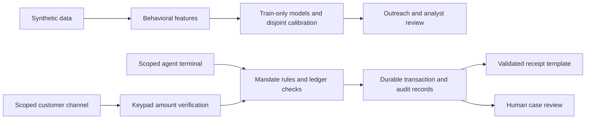

# Architecture and verified boundary

Status:3October. Durable authentication/mandate API verifiedT024; final inference artifacts and console integration pendingT023b/T025. See handoff.md for exact passing gates and design-repair-proposal.md for human approval.

Models prioritize outreach and review; they never authorize, deny or redeem a mandate. Protected demographics and generated labels/types remain evaluation-only, including scoring peer groups. Agent peers are derived from observed training volume. Saved inference must match its feature/config/data/version provenance; missing artifacts mean unavailable.

Approved mandate lifecycle:requested -> verified -> active -> redeemed, or expired/revoked/rejected. Request is bound to one customer, agent, purpose and capped amount. Customer confirmation returns no plaintext code. The bound terminal issues it once; only the hash persists. TTL begins at verification and does not extend upon issuance. Server attempts and row locks enforce replay, balance, assumed fees and Dhaka daily limit. These durable repairs passed T024 local tests and actual HTTP/restart checks.

Keypad and Bangla digit normalization are the essential verification path. Speech recognition, coercion/lie detection and real customer identity verification are not claimed. Cash confirmation after redemption can create an actual review case; reviewer action cannot redeem a mandate. Receipts use real ledger fields and validated templates, with no LLM needed.

Local verified services:PostgreSQL, API18000 and console13000 through Docker Compose; PHP8000 is separate. Production console must use explicit public HTTPS API URL and no mock fallback. Public Render deployment remains pending human dashboard action; no live URL is claimed.

Future integration:provider-governed security/consent review, controlled pilot and validated real-world data. App/USSD/SMS/IVR connectors and cross-provider signals are concepts, not implemented integrations. No real upay transactions or fee figures are used.
