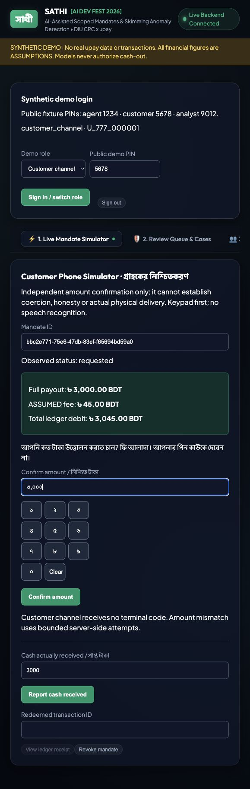
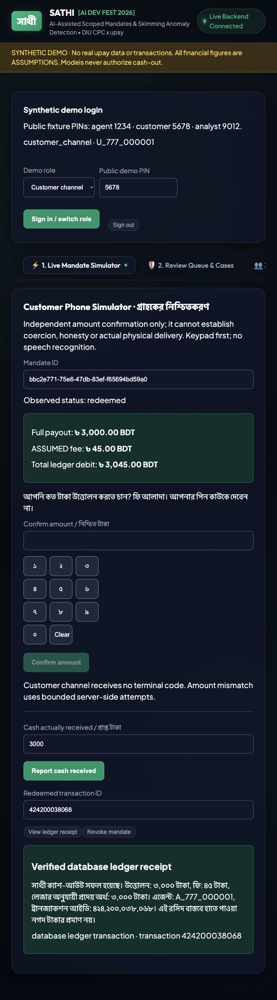
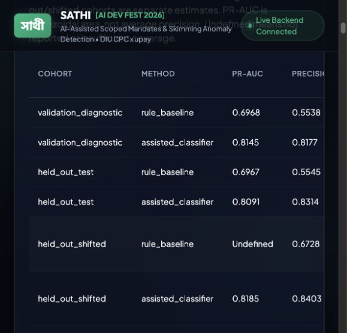

# Sathi — submission report draft

Status: engineering draft, 3 October 2026. Synthetic simulation only. Final evaluation and the durable local API are verified; local console/startup/demo evidence are verified; public deployment and organizer/manual facts remain pending. No real upay customer data, rates or transactions are used.

## Summary

Sathi explores a cash-out flow in which a customer confirms an amount and an agent receives a scoped, expiring, one-time code. Behavioral models suggest outreach and agent review; deterministic policy governs the mandate. A synthetic simulation lets us compare rules and models without collecting customer PINs or personal financial data.

Verified evaluation checkpoint T023b:335 backend tests with zero skips,17 frontend tests, lint/build and one-command reproduction pass; T024 rebuilt Docker API and actual flow pass. The actual local API flow exercised scoped login, amount confirmation, one-time agent code, redemption, replay rejection, cash reporting, receipt and persisted review/lockout state across restart. All preexisting simulation rows and migration001 were preserved. The authenticated console is verifiedT025; T026 full352backend/zero skips and30frontend checks pass. Engineering checks do not establish fraud reduction or real-world accuracy. Held-out assisted PR-AUC is0.8091 versus rule0.6967; simulated agent ensemble detects2/2 injected skimmers and flags0/4 honest high-volume agents. These agent denominators are small; precision@15 is2/15.

## Problem and proposed idea

Consider an illustrative customer who needs assistance using a financial service. Sharing a reusable PIN gives the helper more authority than a single cash-out needs. Sathi proposes limiting that authority by amount, agent and time, while preserving an independent customer amount-confirmation step. The example is fictional.

A qualitative study published21August2025 examined68 interviews with older adults and widows in Kurigram and described assistance needs and PIN sharing when accessing mobile allowances. This supports investigating assisted use; it does not establish national prevalence or validate Sathi's simulation percentages. [Shitol et al., Experiences of older adults and widows with government allowance programmes](https://onlinelibrary.wiley.com/doi/10.1111/ijsw.70033).

## Implemented solution

The project contains a configurable synthetic generator, agent/seed-based splits, rule baselines, LightGBM and anomaly model code, a React console and a FastAPI service. The console displays verified saved predictions, reasons and evaluation results with frozen source/seed/window provenance. Unavailable or tampered artifacts fail closed without substituting sample metrics. Customer, agent and analyst roles are separate.

Verified local API capabilities include durable PostgreSQL mandate state, server-side attempts, scoped synthetic authentication, terminal-only code issuance, exact ledger fees and actual receipts. A3,000BDT synthetic redemption debited3,045BDT with an assumed45BDT fee. Public deployment has not been verified.

## AI approach

Simulation assumptions are in data/config.yaml and data/assumptions.md. Independent and assisted behaviors deliberately overlap, including10% label noise and independently loyal customers. Normal agents, honest high-volume agents and subtle/moderate/obvious injected skimmers support comparisons and false-flag measurement.

User signals come from observed transaction/session behavior. T023 verified train-only LightGBM fitting, frozen-estimator calibration on separate validation agents, and SHAP additivity on that same base model in raw log-odds. Agent scoring combines robust fee deviations and Isolation Forest with references and scaling learned from train agents only. Failed refits preserve the previous fitted model/calibration atomically. Gender, age, region, group_label and agent_type are evaluation-only and excluded from scoring, including peer grouping. Final artifacts use a configured30-day behavioral window with fixed as-of2026-12-30 inside an explicitly synthetic90-day simulation. Earlier credit context informs delay without counting old credits as window activity. Agent cash-gap features use noisy customer reports and ledger amounts, never actual payout truth; missingness/coverage is explicit.

## Evaluation and results

Reproduce from committed source with `make reproduce REPRODUCE_DIR=data/generated/my-reproduction`. Use a fresh directory to preserve older data. Verified run source: `ac18e14bd8f76e3ac4068e2037bfa7dbe29910a7`, clean relevant source; full config/source/dependency/data/observation hashes in [evaluation manifest](../data/artifacts/evaluation-manifest.json). Train/validation/test seeds42/4242/2026 use disjoint180/60/60agent cohorts and12,000/4,000/4,000users. Deterministic training sample4,000users; test estimates cover full cohorts. Calibration uses disjoint validation agents. Validation metrics below are calibration diagnostics, not independent calibrated estimates. Separate shifted data reuse held-out agent IDs and remain disjoint from train/validation.

| User cohort/method | PR-AUC | Precision | Recall | Brier |
|---|---:|---:|---:|---:|
| Validation diagnostic/rule |0.6968|0.5538|0.7536|0.2988|
| Validation diagnostic/LightGBM |0.8145|0.8177|0.8907|0.0939|
| Held-out seed2026/rule |0.6967|0.5545|0.7521|0.2983|
| Held-out seed2026/LightGBM |0.8091|0.8314|0.8914|0.0898|
| Shifted held-out/rule |Not reported|0.6728|0.7360|Not reported|
| Shifted held-out/LightGBM |0.8185|0.8403|0.8500|0.1362|

Canonical and validation each contain4,000users with1,400assisted positives/2,600independent negatives; shifted has4,000users with2,000/2,000. Labels include deliberate noise. PR-AUC convention is trapezoidal `auc(recall, precision)`; it is not average precision. At80% precision the model's maximum attainable held-out recall is0.8964; no qualifying nontrivial rule operating point reaches that precision. Extra5% independent training-label flips beyond baseline10% yield0.8119held-out PR-AUC; this is not pristine-vs-noisy data or exactly15% effective corruption. Validation PR-AUC0.8145 was below0.98; no overlap was adjusted to target a score.

| Agent cohort/method | Recall on skimmers | Honest HV false flags | Precision@15 |
|---|---:|---:|---:|
| Validation/rule |0/2|0/4|2/15|
| Validation/peer,IF,ensemble (each) |2/2|0/4|2/15|
| Canonical/rule |0/2|0/4|2/15|
| Canonical/peer,IF,ensemble (each) |2/2|0/4|2/15|
| Shifted/rule,peer,ensemble (each) |2/2|0/4|2/15|
| Shifted/Isolation Forest |2/2|3/4|2/15|

Each cohort has60agents, including2injected skimmers and4honest high-volume agents. Top-K ranking is distinct from the configured high-risk flag threshold; stable ID tie breaking applies. The shifted IF false flags show that high volume alone can look abnormal under distribution shift. Ensemble performance here is not evidence of field reliability. Approved skimming profiles generated on validation agents yield0/2 subtle detections versus2/2 moderate and2/2 obvious, with0/58honest flags in each sweep. This failure to detect subtle behavior is a material limitation.

Session ablation on validation removes8of36user features: PR-AUC0.8145→0.8014. Report-signal ablation removes all6report-derived agent features: precision@15 and recall stay2/15 and2/2 on this small validation cohort; these results do not establish no real-world value from cash reports. Ablation references/fits use train only. Full fields and dropped columns appear in [generated results](evaluation-results.md) and [JSON](../data/artifacts/deployment/results.json).

Fairness auditing uses demographics only for evaluation. Model maximum TPR gaps are9.205% validation diagnostic,5.604% canonical and5.387% shifted, each within the assumed10% target on these synthetic slices. This does not establish universal fairness. The generated report provides both rule/model gender, age, region and urban/rural rows, positive/negative denominators, TPR/FPR, null handling and any misses; JSON includes review rates. No demographic features or group-specific inference thresholds are used.

## Simulated impact

Adoption is an idealized counterfactual under hypothetical perfect mandate compliance, restricted to effective assisted behavior rather than noisy labels. It measures neither adoption feasibility nor verified physical cash delivery. There are8,810eligible assisted cash-outs,244eligible skimmer actions and326total injected skimmer actions. Eligible assisted loss is14,802.26BDT; total injected loss is18,727.58BDT (2,485.21fee overcharge and16,242.37payout reduction). Every amount is a synthetic ASSUMPTION.

| Adoption ASSUMPTION | Eligible simulated loss prevented (BDT) | Eligible loss % | Total injected loss % |
|---|---:|---:|---:|
|30%|4,440.68|30%|23.71%|
|50%|7,401.13|50%|39.52%|
|70%|10,361.58|70%|55.33%|

These monetary scenarios assume protection from the injected loss for adopting eligible transactions; they do not demonstrate that an amount mandate alone prevents underpayment. Customer reports remain noisy and human follow-up is essential. No production benefit, provider economics or measured PIN-disclosure rate is claimed. Defaults1.5%fee,5,000BDT mandate cap and25,000BDT daily cap are ASSUMPTIONS, never actual upay figures.

## Responsible AI and security

Models prioritize outreach/review and never authorize or deny cash-out. The approved flow uses customer confirmation, bounded attempts, hashed one-time codes, expiry, scope, ledger checks and human review. Fairness gaps must be reported even when the target is missed. No claim of coercion, lie detection or speaker identity verification is made. Audio retention is disabled by policy; keypad/Bangla amount parsing is the essential path.

Verified synthetic security behavior at T024:

| Control | Verified evidence |
|---|---|
| Scope and role | Actor headers alone rejected; training-cohort customer access forbidden; customer code issuance forbidden |
| Amount comprehension | Bangla keypad accepted; invalid numeric inputs422; first mismatch remains requested, second rejects |
| Code use | Bound agent issues once; expiry unchanged; successful redemption followed by replay rejection |
| Lockout and durability | Third wrong code rejected; persisted attempts, receipt and cases survive API restart |
| Financial integrity |3,000BDT payout, assumed45BDT fee,3,045BDT debit; reseed preserves remaining46,955BDT |
| Cash report and review | Identical repeated report idempotent, changed report rejected; actual gap creates a case; human escalation grants no redemption |

## Scalability and integration

A channel-facing API could be piloted with a financial-service provider after governed requirements, security review and real-data validation. This hackathon prototype is not integrated with upay and does not execute real transactions. The verified durable local API demo remains scoped to synthetic identities.

## Innovation and limitations

The contribution is the combination of scoped cash-out authority, independent amount confirmation, behavioral outreach and explainable review. Prior-art comparison requires sourced research before claiming novelty. Synthetic distributions cannot establish real accuracy; sparse injected skimmers limit agent estimates; validation calibration makes validation scores diagnostic. Voice recognition, external LLM narratives and graph extensions are omitted to preserve a reliable keypad demo and reproducible baseline comparison.

## Disclosures

Development tools: Codex orchestration/review/documentation and explicitly approved implementation fallback during quota/CLI outages; Antigravity IDE for inherited work (paused); Antigravity CLI(agy1.2.15) for earlier implementation repairs. Application components include Python/FastAPI/PostgreSQL, React/Vite, LightGBM/scikit-learn/SHAP and standard open-source dependencies. Data are generated locally. No external inference API is required for the current verified console; receipts use validated templates. GitHub hosts source; Render deployment is planned through the human's dashboard and remains unverified.

## Appendix and completion items

Repository: https://github.com/irfan0072/sathi-ai-dev-fest-2026

Local browser dry run: transactions424200038067/424200038068, customer৩,০০০ confirmation, terminal-only issuance, duplicate/replay rejection,2800 report/200gap(case5), ledger receipt and human escalation. Separate2500 mismatch createdcases6/7 and rejected on second attempt. Bootstrap/restarts preserve balances/cases. Screenshots below and a captioned [local walkthrough](demo-walkthrough.html)/[MP4](demo-walkthrough.mp4) provide evidence. The walkthrough is assembled from actual UI captures, not continuous real-time screen recording; active codes are omitted. Final clean-checkout evidence is recorded in [verification record](verification-record.md).

Before submission: obtain human public-repository, deployment (if required), registration and submission-channel/format evidence. No account visibility, live URL or video claim is inferred from local success.

## Local evidence

